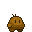

# RadioRoots

> Um jogo 2D onde você controla uma batata mutante tentando sobreviver
> em um esgoto tóxico cheio de ratos e criaturas grotescas.

---

## 🧟 Sobre o jogo

RadioRoots é um jogo de ação com foco em combate corpo a corpo,
ambientado em uma masmorra de esgoto corrompida.

Você controla:
> ***"uma batata mutante que parece amigável"***

[Leia mais sobre o Player](docs/lore/player.md)

---

## 🕳 Ambiente: O Esgoto

Uma masmorra hostil, cheia de:
- poças tóxicas ☣
- ratos agressivos 🐀
- e uma criatura maior espreitando nas sombras…

➡ [Leia mais sobre o Esgoto](docs/lore/esgoto.md)

---

## 👹 Inimigos

| Tipo | Descrição |
|--------|--------------------------|
| Rato   | Primeiro inimigo do jogo |
| Ratona | Boss do esgoto           |

➡ [Detalhes dos inimigos](docs/lore/inimigos.md)

---

## BitCores

Habilidades concedidas por estranhos chips tecnológicos.
➡ [Detalhes dos BitCores](docs/lore/bitcores.md)

---

## ▶ Como jogar

### Sistemas suportados
- Android
- Linux
- Windows

➡ [Baixar última versão](https://github.com/Jovito5s9/Jogo/releases/latest)

➡ [Guia de instalação](docs/tecnico/build.md)

---

## 🧠 Tecnologias

- Python
- Kivy

➡ [Detalhes técnicos](docs/tecnico/stack.md)

---

## 📚 Documentação

- 📖 Lore do mundo → `docs/lore/`
- 🎮 Mecânicas de gameplay → `docs/gameplay/`
- 🛠 Documentação técnica → `docs/tecnico/`

---

## 🐞 Reportar problemas

Encontrou bugs ou comportamentos estranhos?

➡ [Abra uma Issue](https://github.com/Jovito5s9/Jogo/issues)

---

## Contribuições

Este projeto não aceita contribuições automáticas.

Se você deseja contribuir, entre em contato antes de abrir um pull request.

---

⭐ **O jogo segue em desenvolvimento**  
Se curtiu a ideia, considere dar uma estrela no repositório!
