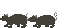
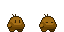
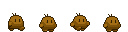
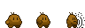
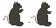

# RadioRoots
---
## Descrição
Este é um jogo em que você controla uma batata mutante e enfrenta os desafios de sobreviver no esgoto, uma masmorra, cheia de ratos e poças tóxicas.
---

## O Esgoto

É uma masmorra que possui ambientação tematizada

um inimigo

e um BOSS

---
## O player

***'uma batata mutante que parece amigável'***

Tem a aparência de uma batata, mas se move

ele consegue dar socos

e quando morre fica inerte como uma batata

## Ratos

***'que coisa peluda mais feia, parece estar salivando'***

Os ratos são o primeiro inimigo adicionado ao jogo sendo encontrados no esgoto e possuem a aparência de um rato comum, mas seus olhos parecem injetados de sangue

eles se levantam para tentar comer batata, causa dano

## Ratona(BOSS)

***'maior que um rato e tão fedorento como um gambá'***

A ratona é o primeiro boss adicionado ao jogo e pode ser encontrado no esgoto e possue a aparência de um rato mais robusto e vigoroso, ele se locomove rolando em alta velocidade, causa dano no contato

---

### O jogo sege em desenvolvimento, por isso se tiver interesse considere estrelar esse repositório
