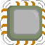
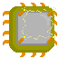
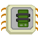

##### [retornar para o README](../../README.md)

---

# BitCores

_'São pequenos chips tecnologicos esquecidos pela humanidade, eles não possuem muita potência (computacional),
mas uma batata pode acabar fazendo bom uso dessa tecnologia.'_

cada BitCore traz uma habilidade consigo, sendo passiva e/ou condicional, é possivel equipar apenas 2
simuntaneamente

# Guia de ativação

para ativar um BitCore primeiro entre no menu do player,

No modo de input "teclado" clique a tecla _'e'_ na tela de jogo

No modo toque clique em  e depois em 

após entrar na aba de equipaveis veja se há slots livres, caso todos estejam ocupados libere para equipar um novo
selecione um dos Bitcores disponíveis, abaixo da descrição haverá um um botão escrito _'equipar'_

---

### Atualmente existem 5 BitCores:

|| nome | nome da skill | raridade | descrição|
| :---: | :---: | :---: | :---: | :---: |
|| núcleo ceifador de energia | vampirismo | raro | Um chip que converte a energia liberada no impacto em bioenergia, realimentando os sistemas vitais. |
|| núcleo do instinto de pânico | pânico | raro | Um chip neural que intercepta sinais de dor e os converte em impulsos motores acelerados. |
|| núcleo da esquiva aleatória | esguio | raro | Um núcleo neural instável que ativa reflexos evasivos de forma imprevisível. |
|| núcleo do punho explosivo | pistão | raro | Um núcleo que aumenta a potência dos movimentos. |
|| núcleo da vitalidade extendida | robusto | raro | Um chip energético que fornece tempo de uso extra. |
