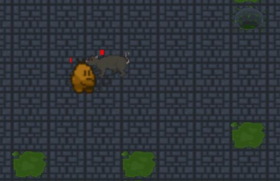

# O Esgoto

É uma masmorra que possui ambientação tematizada 

 

---

## inimigos

#### rato

é o inimigo comum encontrado em todos os níveis dentro da masmorra
eles são relativamente fracos, mas em contrapartida são muito numerosos

[veja mais sobre o rato aqui](inimigos.md)

#### BOSS 

pode ser encontrado no 10 nível da masmorra, sua sala estará infestada de ratos

[veja mais sobre o BOSS aqui](inimigos.md)

---

## passando pela masmorra

pra avançar um nível na masmorra é necessário entrar nos buracos após limpar as salas

e para voltar um nível, após esvaziar a sala, o player deve subir através de plantas

ao retornar a uma sala previamente limpa pelo player, a sala ainda terá ratos, mas não estará infestada como na primeira vez

as salas podem ter modificadores que aumentam a taxa de inimigos em 2.5 na masmorra ou de gerar mais poças de veneno
