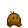
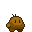
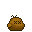

##### [retornar para o README](../../README.md)

---

# O player

***'uma batata mutante que parece amigável'***

## Aparência

Tem a aparência de uma batata, mas se move

ele consegue dar socos

e quando morre fica inerte como uma batata deveria estar

---

## Ataques

- Soco: o player lança um golpe para a direita ou esquerda, causando dano e repulsão comuns
- Golpe pesado: o player golpeia com mais impeto, dano é 20% maior que o soco normal, e a repulsão 50%

o player é capaz de equipar [BitCores](bitcores.md) para ganhar outras habilidades.